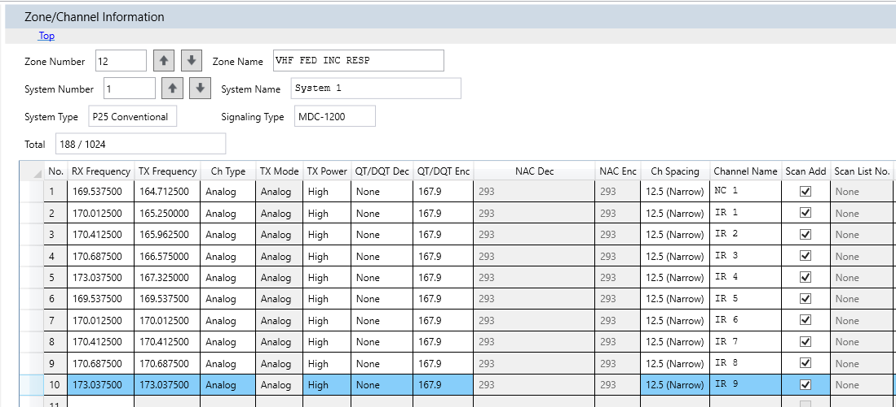

# MTCP CODEPLUGS REPOSITORY
 Collection of Codeplugs with Massachusetts Tactical Channel Plan Required Channels such as VTAC, UTAC, VHF Fed LAW, Bapern, etc. Note that these are *required* to be programmed into any part 47 compliant radios being used in any municipal capacity (assuming they have the capability to transmit and receive on these frequencies).

 

This is a work in progress that I am compiling as I create new codeplugs for Modular Communications LLC.

In each software's folder, there will be instructions on how to import/copy and paste the zones/systems into the current codeplug/personality you're editing.
 

##### If you've found these helpful for your work or hobby use, consider showing your support :)

Thanks!